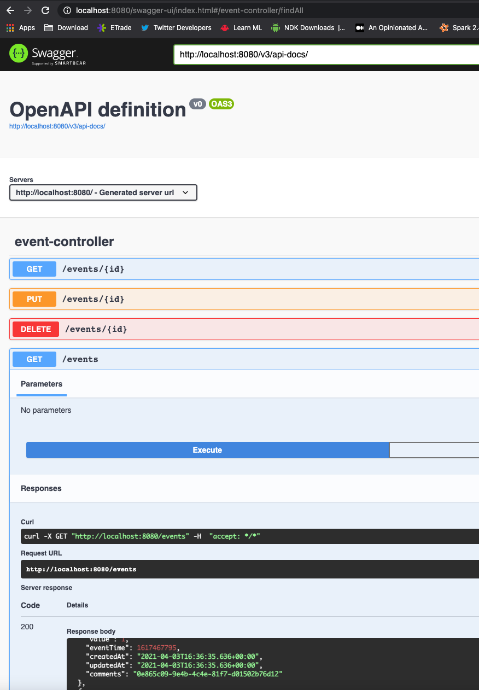

# service-a

## About

Project containing JPA & search :

* List all events : GET [http://localhost:8080/events/](http://localhost:8080/events/)
* Create an event : POST [http://localhost:8080/events/](http://localhost:8080/events/)
* Find by ID : GET [http://localhost:8080/events/1](http://localhost:8080/events/1)
* Modify an event : GET [http://localhost:8080/events/1](http://localhost:8080/events/1)
* Delete an event : DELETE [http://localhost:8080/events/1](http://localhost:8080/events/1)

## API

* Access Swagger API at [http://localhost:8080/swagger-ui/index.html](http://localhost:8080/swagger-ui/index.html)
* Paste the API Docs (JSON) at [http://localhost:8080/v3/api-docs/](http://localhost:8080/v3/api-docs/)

